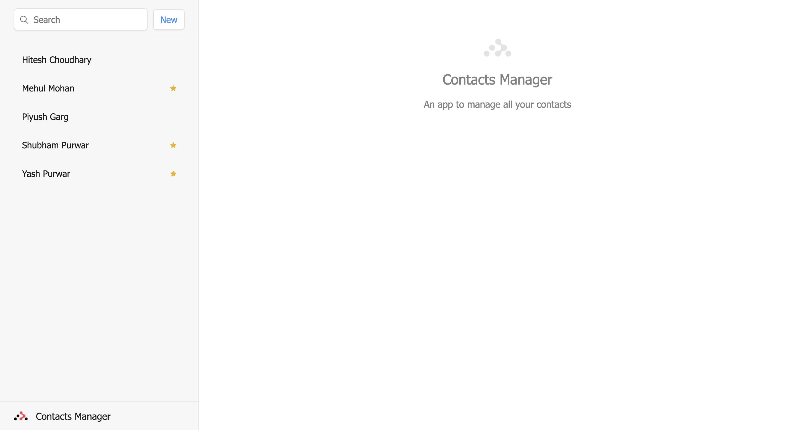

# Contacts Manager

## 0. Table of Contents

1. [Overview](#1-overview)
2. [Live Demo](#2-live-demo)
3. [Live Link](#3-live-link)
4. [Main Features](#4-main-features)
5. [Tools and technologies used](#5-tools-and-technologies-used)

## 1. Overview

A CRUD application that allows users to manage their contacts. It is built with `React` and utilises `Firebase Firestore` to store data.

## 2. Live Demo

To checkout the **live demo video** of contacts manager, click on the below image.

## 3. Live Link

Contacts manager is deployed on Vercel. **Live link** of the deployed project - [click here](https://contacts-manager-gamma.vercel.app/).

## 4. Main Features

- Add new contact
- Update a contact
- Delete a contact
- Search contacts by name
- Mark or unmark a contact as favorite

## 5. Tools and technologies used

- Vite to initialize React project
- Vanilla CSS to style UI components
- React Router v6 to implement client side routing
- Firestore database of Firebase to store data
- Vercel for deployment
